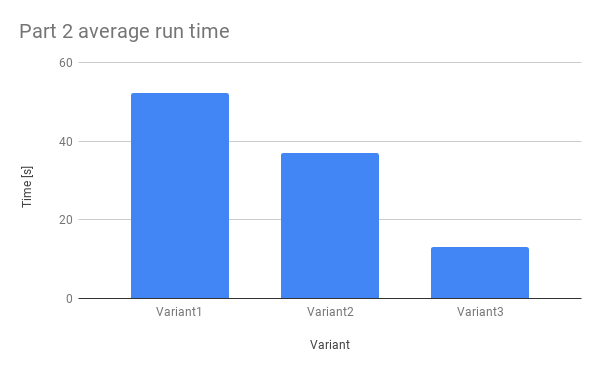
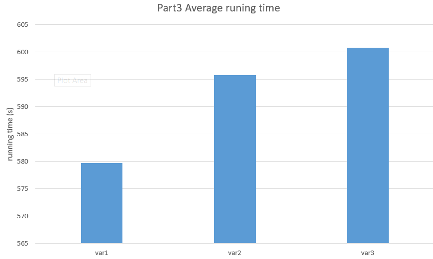

## 1. What is the output that you received from running part 1?

	Process 0 sending 10 to 1, tag 201 (4 processes in ring)
	Process 0 sent to 1
	Process 0 decremented value: 9
	Process 0 decremented value: 8
	Process 0 decremented value: 7
	Process 0 decremented value: 6
	Process 0 decremented value: 5
	Process 0 decremented value: 4
	Process 0 decremented value: 3
	Process 0 decremented value: 2
	Process 0 decremented value: 1
	Process 0 decremented value: 0
	Process 0 exiting
	Process 1 exiting
	Process 2 exiting
	Process 3 exiting

## 2. Show the plot of average execution times and standard deviation from part 2.

### Why do you think there is a difference in the execution times?

In the first variant, the full overhead of using the TCP protocol is
incurred by every process. In the second variant, only processes on
different nodes need to use TCP and can use shared memory for their
intercommunication, which is much faster. Finally, the TCP overhead
between the nodes is reduced in the third variant by using the usNIC
interconnect. These improvements decrease both execution time as well as
variability in execution time. 

## 3. Show the plot of average execution times and standard deviation from part 3.

### Why do you think there is a difference in the execution times?

In this run, the limitiing factor does not seem to have been
inter-process communication, as the shared memory and usNIC activations
have hardly changed execution times; the only apparent change with their
activation is that runtime has become more consistent, with standard
deviation decreasing as shared memory is added, and even further
decreasing as usNIC is enabled.
